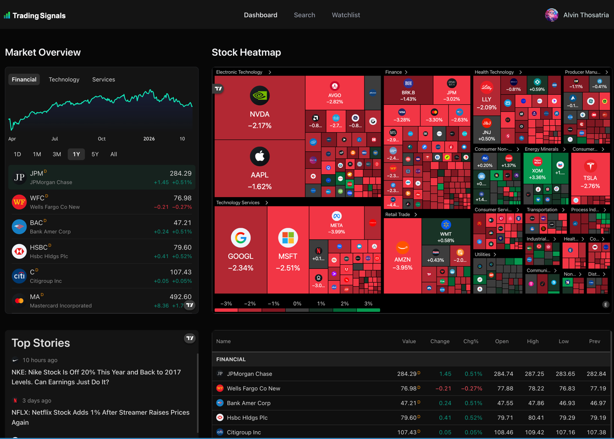
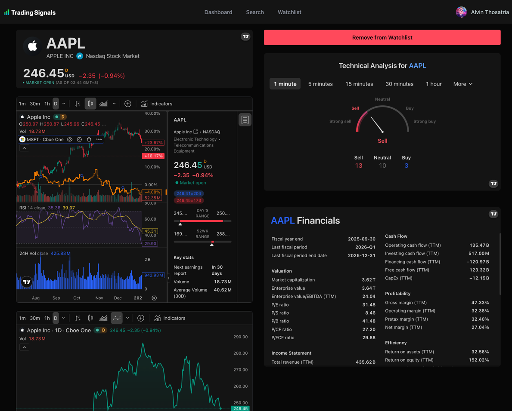
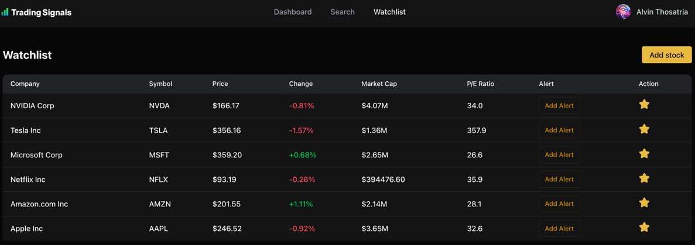
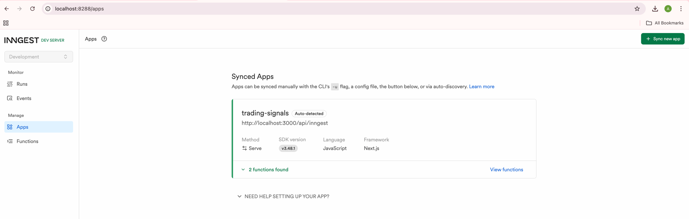

# [Trading Signals - Real-Time Stock Market App & Market News Aggregation](https://trading-signals-stock-tracker-app.vercel.app/)

A comprehensive real-time stock market application built with **Next.js 15**, **TypeScript**, and **Tailwind CSS**. This platform provides users with live stock market insights, interactive charts, personalized market news alerts, and the ability to explore detailed company insights.







### Key Features
- **Real-Time Data**: Seamless integration with the `Finnhub API` and `TradingView` for live market tracking, stock searching, and sophisticated visualization.
- **AI-Powered Insights**: Leveraging `Gemini AI` to generate personalized market news summaries based on specific prompt details.
- **Watchlist Management**: Securely manage your favorite stocks with full CRUD operations, backed by `MongoDB`.
- **Advanced Authentication**: Robust user authentication and session management using `Better Auth`.
- **Event-Driven Workflows**: Asynchronous background jobs, personalized alerts, and serverless functions powered by `Inngest`.
- **Email Notifications**: Automated email templates and delivery via `Nodemailer`.
- **Modern UI**: A sleek, responsive user interface built with `Radix UI` primitives and `Shadcn` components.

## Getting Started

### 1. Run the development server:

```bash
npm run dev
# or
yarn dev
# or
pnpm dev
# or
bun dev
```

Open [http://localhost:3000](http://localhost:3000) with your browser to see the result.

You can start editing the page by modifying `app/page.tsx`. The page auto-updates as you edit the file.

This project uses [`next/font`](https://nextjs.org/docs/app/building-your-application/optimizing/fonts) to automatically optimize and load [Geist](https://vercel.com/font), a new font family for Vercel.

### 2. Run Inngest Server in a Separate Terminal
```aiignore
npx inngest-cli@1.11.9 dev
```

Open [http://localhost:8288](http://localhost:8288) with your browser to see the result.


